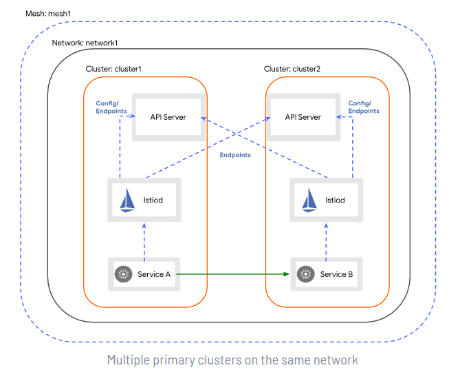

# Multicluster Istio on AKS

This sample shows how to Install an [Istio](https://istio.io/) mesh across multiple [Azure Kubernetes Service (AKS)](https://learn.microsoft.com/en-us/azure/aks/intro-kubernetes) clusters. For more information, see [Install Multicluster](https://istio.io/latest/docs/setup/install/multicluster/) in the Istio documentation.

## Deploy Kubernetes clusters

The Terraform code in this repository is provided for demo purposes and deploys the network topology shown in the following diagram.


The infrastructure is composed of two regional sites each hosting an AKS cluster. In each region, the infrastructure is composed of the following resources:

- A virtual network in each region with the following subnets:
  - `System` used by the AKS system node pool
  - `User` used by the AKS user node pool
  - `AppGateway` used by the Application Gateway
  - `AzureBastionHost` used bu Azure Bastion
  - `PrivateEndpoints` used by Azure Private Endpoints
- A virtual network peering between the two regional virtual networks
- A user-defined managed identity used as identity by the AKS cluster
- An AKS cluster uses composed of two node pools, each in separate subnet:
  - `System` node pool hosting only critical system pods and services. The worker nodes have node taint which prevents application pods from beings scheduled on this node pool.
  - `User` node pool hosting user workloads and artifacts.
- An Azure Key Vault instance.
- An Azure Bastion resource that provides secure and seamless SSH connectivity to the AKS agent nodes over SSL
- An Azure Container Registry (ACR) to build, store, and manage container images and artifacts in a private registry for all types of container deployments. 
- When the ACR SKU is equal to Premium:
  - The registry has two replicas, one in each region.
  - A Private Endpoint is created to allow the private AKS cluster to access ACR via a private IP address. For more information, see [Connect privately to an Azure container registry using Azure Private Link](https://docs.microsoft.com/en-us/azure/container-registry/container-registry-private-link).
- A Private DNS Zone for the name resolution of ACR and Key Vault private endpoints.
- A Virtual Network Link between each Private DNS Zone and the two regional virtual networks.
- A Log Analytics workspace to collect the diagnostics logs and metrics of both the AKS cluster and other Azure services.

When deploying the two AKS clusters to the same region, the Terraform module deploys a single Azure Bastion Host and Azure Log Analytics workspace as shown by the following diagram:


The Istio CA is managed offline and the cluster certificates are stored in Azure Key Vault.

## Requirements

Install the following software to your computer:

- [Terraform](https://learn.hashicorp.com/tutorials/terraform/install-cli).
- [Azure CLI](https://learn.microsoft.com/en-us/cli/azure/install-azure-cli).

## Deploy the infrastructure via Terraform

Change the working directory to the `istio` folder which contains Terraform modules and run the following command to install the entire infrastructure to Azure:

```sh
terraform init -upgrade && terraform apply -var-file=terraform.tfvars
```

Before starting, make sure to properly set values for the variables imported and used by all the scripts in the `00-variables.sh` file in the `scripts` folder.

```sh
# Variables
prefix="<resource-prefix>"
aksClusterOneLocation="<aks-location-one>"
aksClusterTwoLocation="<aks-location-two>"
aksClusterOneName="$prefix-$aksClusterOneLocation-aks-one"
aksClusterTwoName="$prefix-$aksClusterTwoLocation-aks-two"
aksClusterOneResourceGroupName="$prefix-$aksClusterOneLocation-one-rg"
aksClusterTwoResourceGroupName="$prefix-$aksClusterTwoLocation-two-rg"
sharedResourceGroupLocation="<shared-resource-group-location>"
sharedResourceGroupName="$prefix-$sharedResourceGroupLocation-shared-rg"
certsDir="../certificates"
istioDir="../istio"
scriptsDir="./scripts"
clusters=($aksClusterOneName $aksClusterTwoName)
terraformDirectory=".."
istioRevision="1-14-1"
yamlDir="../yaml"
tag="1.14.1"
namespace="echoserver"
podName="curlclient"
containerName="curlclient"
imageName="nginx"
command="curl echoserver:8080"
certificateName="frontend-certificate"
applicationGatewayName="aks-appgw-$aksClusterLocation"
rootCertificateName="root-certificate"
rootCertificateFile="../certificates/$aksClusterOneName/root-cert.pem"
echoserverCertificateName="echoserver"
echoserverDir="echoserver"
```

Use the `01-get-credentials.sh` script under the `istio/scripts` folder to get access credentials for the AKS clusters.

```sh
# Variables
prefix="<resource-prefix>"
aksClusterOneLocation="<aks-location-one>"
aksClusterTwoLocation="<aks-location-two>"
aksClusterOneName="$prefix-$aksClusterOneLocation-aks-one"
aksClusterTwoName="$prefix-$aksClusterTwoLocation-aks-two"
aksClusterOneResourceGroupName="$prefix-$aksClusterOneLocation-one-rg"
aksClusterTwoResourceGroupName="$prefix-$aksClusterTwoLocation-two-rg"

# Get credentials for AKS cluster one
az aks get-credentials \
  --resource-group $aksClusterOneResourceGroupName \
  --name $aksClusterOneName \
  --overwrite-existing

# Get credentials for AKS cluster two
az aks get-credentials \
  --resource-group $aksClusterTwoResourceGroupName \
  --name $aksClusterTwoName \
  --overwrite-existing
```

You can test credentials by running the following script:

```sh
aksClusterOneName="<aks-cluster-one-name>"
aksClusterTwoName="<aks-cluster-two-name>"

kubectl --context=$aksClusterOneName get nodes
kubectl --context=$aksClusterTwoName get nodes
```

## Install Istio

In this section you will find scripts and steps to install `Istio` on the two clusters deployed using Terraform modules.

### Istio CA

By default the Istio installation creates a self-signed Certification Authority (CA) along with a root certificate and key and uses them to sign the workload certificates. 
Two Istio installations with two different self-signed CAs cannot trust each other.
For this reason the first step to deploy Istio in multicluster is to create a Certification Authority that will be trusted by both clusters.

This process is documented in detail in [Plug in CA Certificates](https://istio.io/latest/docs/tasks/security/cert-management/plugin-ca-cert/)

The `02-create-root-ca.sh` script under the `istio/scripts` folder creates a root CA and certificate per each cluster.:

```sh
# Variables
prefix="<resource-prefix>"
aksClusterOneLocation="<aks-location-one>"
aksClusterTwoLocation="<aks-location-two>"
aksClusterOneName="$prefix-$aksClusterOneLocation-aks-one"
aksClusterTwoName="$prefix-$aksClusterTwoLocation-aks-two"
certsDir="../certificates"
istioDir="../istio"

# Clone the Istio GitHub repo locally
git clone git@github.com:istio/istio.git $istioDir

# Create CA certificates folder
if [ ! -d $certsDir ]; then
  mkdir $certsDir
fi

# Create CA certificates
cd $certsDir
make -f ../istio/tools/certs/Makefile.selfsigned.mk root-ca
make -f ../istio/tools/certs/Makefile.selfsigned.mk $aksClusterOneName-cacerts
make -f ../istio/tools/certs/Makefile.selfsigned.mk $aksClusterTwoName-cacerts
```

### Istio CA with Key Vault

You can run the `03-store-certs-to-key-vault.sh` script under the `istio/scripts` folder to store the cluster certificates we created at the previous step into Azure Key Vault.

```sh
# Variables
prefix="<resource-prefix>"
aksClusterOneLocation="<aks-location-one>"
aksClusterTwoLocation="<aks-location-two>"
sharedResourceGroupName="$prefix-$aksClusterOneLocation-shared-rg"
aksClusterOneName="$prefix-$aksClusterOneLocation-aks-one"
aksClusterTwoName="$prefix-$aksClusterTwoLocation-aks-two"
clusters=($aksClusterOneName $aksClusterTwoName)
certsDir="../certificates"

# Change the working directory to the certificates folder
cd $certsDir

# Retrieve Azure Key Vault name
keyVaultName=$(az keyvault list --resource-group $sharedResourceGroupName --query [0].name --output tsv)

# Store the root certificate to Azure Key Vault as a secret
az keyvault secret set \
  --vault-name $keyVaultName \
  --name root-cert \
  --file root-cert.pem

for cluster in ${clusters[@]}; do
  cd $cluster

  # Create a PFX certificate using the CA certificate and private key
  openssl pkcs12 \
    -inkey ca-key.pem \
    -in ca-cert.pem \
    -export \
    -passout pass: \
    -out ca-cert-and-key.pfx

  # Store the root certificate chain to Azure Key Vault as a secret
  az keyvault secret set \
    --vault-name $keyVaultName \
    --name $cluster-cert-chain \
    --file cert-chain.pem
  
  # Store the CA certificate to Azure Key Vault as a certificate
  az keyvault certificate import \
    --vault-name $keyVaultName \
    --name $cluster-ca-cert \
    --file ca-cert-and-key.pfx

  cd ..
done
```

### Create the ServiceProviderClass

The [Azure Key Vault Provider for Secrets Store CSI Driver](https://learn.microsoft.com/en-us/azure/aks/csi-secrets-store-driver) allows for the integration of an Azure key vault as a secrets 
store with an Azure Kubernetes Service (AKS) cluster via a CSI volume.
Now let's create a `SecretProviderClass` that will allow Istio to consume secrets from the Azure Key Vault.
The `SecretProviderClass` object needs to be created in the `istio-system` namespace.
Run the `04-create-service-provider-class.sh` script under the `istio/scripts` folder to create the `istio-system namespace` and `SecretProviderClass` entity in each AKS cluster:

```sh
# Variables
prefix="<resource-prefix>"
aksClusterOneLocation="<aks-location-one>"
aksClusterTwoLocation="<aks-location-two>"
aksClusterOneName="$prefix-$aksClusterOneLocation-aks-one"
aksClusterTwoName="$prefix-$aksClusterTwoLocation-aks-two"
terraformDirectory=".."
clusters=($aksClusterOneName $aksClusterTwoName)

# Create istio-system namespace in AKS clusters
for cluster in ${clusters[@]} ; do 
  kubectl create --context=$cluster namespace istio-system
done

# Change the working directory to the Terraform folder
cd $terraformDirectory

# Create SecretProviderClass in the istio-system namespace in the first cluster
terraform output -raw secret_provider_class_location_one | kubectl --context=$aksClusterOneName -n istio-system apply -f -

# Create SecretProviderClass in the istio-system namespace in the second cluster
terraform output -raw secret_provider_class_location_two | kubectl --context=$aksClusterTwoName -n istio-system apply -f -
```

### Install Istioctl

Before installing Istio on AKS cluster, mek sure to install [istioctl](https://istio.io/latest/docs/reference/commands/istioctl/) command line utility for service operators to debug and diagnose their Istio mesh.
For more information, see [Install istioctl](https://istio.io/latest/docs/ops/diagnostic-tools/istioctl/#install-hahahugoshortcode-s2-hbhb). You can install the `istioctl` binary using the `06-install-istioctl.sh` script in the `scripts` folder:

```sh
# Download istioctl
curl -sL https://istio.io/downloadIstioctl | sh -

# Add the `istioctl` client to your path, on a macOS or Linux system
export PATH=$HOME/.istioctl/bin:$PATH
```

You can optionally enable the [auto-completion option](https://istio.io/latest/docs/ops/diagnostic-tools/istioctl/#enabling-auto-completion) when working with a bash or ZSH console.

### Install Istio in the clusters

This sample will guide you through the necessary steps to install the Istio control plane on two AKS clusters, making each a primary cluster. 
Both clusters reside in their own virtual network in the same region or different regions.
The two virtual networks are peered, meaning there is direct connectivity between the pods in both clusters.
For more information on this Istio configuration, see [Install Multi-Primary](https://istio.io/latest/docs/setup/install/multicluster/multi-primary/).



Let's create the `istio-ingress` namespace to install the [Istio Ingress Gateways](https://istio.io/latest/docs/tasks/traffic-management/ingress/ingress-control/) for the North/South traffic, and let's enable injection in this namespace.

```sh
# Variables
prefix="<resource-prefix>"
aksClusterOneLocation="<aks-location-one>"
aksClusterTwoLocation="<aks-location-two>"
aksClusterOneName="$prefix-$aksClusterOneLocation-aks-one"
aksClusterTwoName="$prefix-$aksClusterTwoLocation-aks-two"
istioRevision="1-14-1"

# Create the istio-ingress namespace in the first cluster
kubectl create --context=$aksClusterOneName namespace istio-ingress

# Enable automatic Istio sidecar injection for the istio-ingress namespace in the first cluster
kubectl label --context=$aksClusterOneName namespace istio-ingress istio.io/rev=$istioRevision

# Create the istio-ingress namespace in the second cluster
kubectl create --context=$aksClusterTwoName namespace istio-ingress

# Enable automatic Istio sidecar injection for the istio-ingress namespace in the second cluster
kubectl label --context=$aksClusterTwoName namespace istio-ingress istio.io/rev=$istioRevision
```

We are now ready to install istio on both clusters using `istioctl`. For more information, see [Install with Istioctl](https://istio.io/latest/docs/setup/install/istioctl/):

```sh
# Variables
prefix="<resource-prefix>"
aksClusterOneLocation="<aks-location-one>"
aksClusterTwoLocation="<aks-location-two>"
aksClusterOneName="$prefix-$aksClusterOneLocation-aks-one"
aksClusterTwoName="$prefix-$aksClusterTwoLocation-aks-two"
yamlDir="../yaml"
istioRevision="1-14-1"
tag="1.14.1"

# Change the working directory to the yaml folder
cd $yamlDir

# Install Istio on cluster one
istioctl install -y \
  --context=$aksClusterOneName \
  --set profile=minimal \
  --revision=$istioRevision \
  --set tag=$tag \
  -f 001-accessLogFile.yaml \
  -f 002-multicluster-region-one.yaml \
  -f 003-istiod-csi-secrets.yaml \
  -f 004-ingress-gateway.yaml

# Install Istio on cluster two
istioctl install -y \
  --context=$aksClusterTwoName \
  --set profile=minimal \
  --revision=$istioRevision \
  --set tag=$tag \
  -f 001-accessLogFile.yaml \
  -f 002-multicluster-region-two.yaml \
  -f 003-istiod-csi-secrets.yaml \
  -f 004-ingress-gateway.yaml
```

### Configure secrets for the remote endpoints

To attach the remote cluster to its control plane, we give the control plane in first cluster access to the API Server in the second cluster and vice versa. This will do the following:

- Enables the control plane to authenticate connection requests from workloads running in the remote cluster. Without API Server access, the control plane will reject the requests.
- Enables discovery of service endpoints running in the remote cluster.

This step configures in each cluster the secret to reach the other one. Note that the Kubernetes secret contains also the cluster endpoint, it is like a `kubectl configuration`.
You can use the `08-configure-remote-endpoint-secret.sh` script in the `scripts` folder to create the secrets in the AKS clusters.

```sh
prefix="<resource-prefix>"
aksClusterOneLocation="<aks-location-one>"
aksClusterTwoLocation="<aks-location-two>"
aksClusterOneName="$prefix-$aksClusterOneLocation-aks-one"
aksClusterTwoName="$prefix-$aksClusterTwoLocation-aks-two"

# Create a secret with credentials to allow Istio to access remote Kubernetes API servers in the first cluster
istioctl x create-remote-secret \
  --context=$aksClusterTwoName \
  --name=$aksClusterTwoName | kubectl --context=$aksClusterOneName apply -f - 

# Create a secret with credentials to allow Istio to access remote Kubernetes API servers in the second cluster
istioctl x create-remote-secret \
  --context=$aksClusterOneName \
  --name=$aksClusterOneName | kubectl --context=$aksClusterTwoName apply -f -  
```

### Validate multicluster East-West connectivity

Now we can verify that the multicluster Istio installation is working properly and cluster are connected to each other.
You can use the `09-validate-istio-multicluster.sh` script in the `scripts` folder to accomplish this verification.

```sh
# Variables
prefix="<resource-prefix>"
aksClusterOneLocation="<aks-location-one>"
aksClusterTwoLocation="<aks-location-two>"
aksClusterOneName="$prefix-$aksClusterOneLocation-aks-one"
aksClusterTwoName="$prefix-$aksClusterTwoLocation-aks-two"

# Lists the remote clusters the first cluster is connected to
$ istioctl remote-clusters --context=$aksClusterOneName

# Lists the remote clusters the second cluster is connected to
$ istioctl remote-clusters --context=$aksClusterTwoName
```

If the validation succeeds, you should see an output like the following one:

```sh
NAME                      SECRET                                                      STATUS ISTIOD
prefix-eastus2-aks-two    istio-system/istio-remote-secret-prefix-eastus2-aks-two     synced istiod-1-14-1-db758fdc5-47g96
NAME                      SECRET                                                      STATUS ISTIOD
prefix-westeurope-aks-one istio-system/istio-remote-secret-prefix-westeurope-aks-one  synced istiod-1-14-1-5df557b459-hkb8j
```

## Deploy a test application

Let's deploy an `echoserver` and let's access it from the other cluster. An `echoserver` is an application that allows a client and a server to connect so a client can send a message to the server and the server can receive the message and send, or echo, it back to the client. We use the `10-deploy-echoserver.sh` script in the `scripts` folder to create a deployment called `echoserver` only in the first region. In order to make the `echoserver` service callable from any cluster, the DNS lookup must succeed in each cluster. We can achieve this by creating a `ClusterIP` service called `echoserver` in both regions. This will make it possible to resolve the DNS name `echoserver`.

### Create deployment and services

You can use the `10-deploy-echoserver.sh` script in the `scripts` folder to create the deployment

```sh
# Variables
aksClusterOneName="$prefix-$aksClusterOneLocation-aks-one"
aksClusterTwoName="$prefix-$aksClusterTwoLocation-aks-two"
yamlDir="../yaml"
istioRevision="1-14-1"

# Create echoserver namespace in the first cluster
kubectl create --context=$aksClusterOneName namespace echoserver

# Enable automatic Istio sidecar injection for the echoserver namespace in the first cluster
kubectl label --context=$aksClusterOneName namespace echoserver istio.io/rev=$istioRevision

# Create the echoserver deployment and service in the echoserver namespace in the first cluster
kubectl apply --context=$aksClusterOneName -n echoserver -f $yamlDir/echoserver.yaml -f $yamlDir/echoserver-svc.yaml

# Create echoserver namespace in the second cluster
kubectl create --context=$aksClusterTwoName namespace echoserver

# Enable automatic Istio sidecar injection for the echoserver namespace in the second cluster
kubectl label --context=$aksClusterTwoName namespace echoserver istio.io/rev=$istioRevision

# Create the echoserver service in the echoserver namespace in the second cluster
kubectl apply --context=$aksClusterTwoName -n echoserver -f $yamlDir/echoserver-svc.yaml
```

You can run the `11-call-echoserver-service-from-cluster-two.sh` script in the `scripts` folder to call the `echoserver` service from the remote cluster in the second region:

```sh
# Variables
prefix="<resource-prefix>"
aksClusterTwoLocation="<aks-location-two>"
aksClusterTwoName="$prefix-$aksClusterTwoLocation-aks-two"
namespace="echoserver"
podName="curlclient"
containerName="curlclient"
imageName="nginx"
command="curl echoserver:8080"

# Create pod if not exists
result=$(kubectl get pod --namespace $namespace -o jsonpath="{.items[?(@.metadata.name=='$podName')].metadata.name}")

if [[ -n $result ]]; then
  echo "[$podName] pod already exists in the [$namespace] namespace"
else
  echo "[$podName] pod does not exist in the [$namespace] namespace"
  echo "creating [$podName] pod in the [$namespace] namespace..."
  kubectl run $podName --image=$imageName --namespace $namespace

  while [[ $(kubectl get pod --namespace $namespace \-o 'jsonpath={..status.conditions[?(@.type=="Ready")].status}') != "True" ]]; do 
      echo "waiting for [$podName] pod" 
      sleep 1
  done
fi

# Invoke the echoserver as a local service
kubectl exec -it $podName --context=$aksClusterTwoName --namespace $namespace --container $containerName -- $command

# Delete the pod
kubectl delete pod $podName --context=$aksClusterTwoName --namespace $namespace 
```

### Expose the Istio ingress gateway

Before we begin remember that in `004-ingress-gateway.yaml` we patched the `istio-ingressgateway` service to be `ClusterIP`, because we are going to expose the service via the [Azure Application Gateway](https://learn.microsoft.com/en-us/azure/application-gateway/overview) that was deployed by the Terraform module along with each AKS cluster and the related  [Azure Application Gateway Ingress Controller](https://learn.microsoft.com/en-us/azure/application-gateway/ingress-controller-overview).

We are now going to expose the `istio-ingressgateway` only in the AKS cluster in the first region. You can apply the following configuration to both clusters if you want.

Let's configure the Kubernetes ingress object to expose the service and the Istio gateway.
A [Kubernetes ingress](https://kubernetes.io/docs/concepts/services-networking/ingress/) is an API object that manages external access to the services in a cluster, typically via HTTP/S. Ingress may provide load balancing, SSL termination and name-based virtual hosting.
An [Istio Gateway](https://istio.io/latest/docs/reference/config/networking/gateway/) describes a load balancer operating at the edge of the mesh receiving incoming or outgoing HTTP/TCP connections. The specification describes a set of ports that should be exposed, the type of protocol to use, SNI configuration for the load balancer, etc.

For demo purposes, let's first use an ingress defined in the `ingress.yaml` manifest in the `yaml` folder that exposes the `echoserver` service via the `HTTP` protocol.

```yaml
apiVersion: networking.k8s.io/v1
kind: Ingress
metadata:
  name: istio-ingress-application-gateway
  annotations:
     kubernetes.io/ingress.class: azure/application-gateway
spec:
  rules:
  - http:
      paths:
      - path: /
        pathType: Prefix
        backend:
          service:
            name: ingressgateway
            port:
              number: 80
```

The `gateway.yaml` manifest in the `yaml` folder contains the definition of the Istio Gateway.

```yaml
apiVersion: networking.istio.io/v1beta1
kind: Gateway
metadata:
  name: istio-ingressgateway
  namespace: istio-ingress
spec:
  selector:
    app: istio-ingressgateway
  servers:
  - port:
      number: 80
      name: http
      protocol: HTTP
    hosts:
    - '*'
```

In a production environment we strongly recommend to configure the `ingress` object to expose the service via `HTTPS` with a TLS certificate and related host.
In the next section, we'll see how to expose the `echoserver` service via `HTTPS` using another ingress object.

You can use the `12-deploy-ingress-and-gateway.sh` script in the `scripts` folder to deploy the ingress and gateway object to the `echoserver` namespace in the first cluster.

```sh
# Variables
prefix="<resource-prefix>"
aksClusterOneLocation="<aks-location-one>"
aksClusterOneName="$prefix-$aksClusterOneLocation-aks-one"
yamlDir="../yaml"

# Deploy the Istio gateway to the istio-ingress namespace in the first cluster
kubectl apply --context=$aksClusterOneName -f $yamlDir/gateway.yaml

# Deploy the ingress to the echoserver namespace in the first cluster
kubectl apply --context=$aksClusterOneName -f $yamlDir/ingress.yaml
```

The gateway object that we just created is responsible to create a load balancer and expose ports, but it0s not responsible for request routing.
You can call the public endpoint exposed by the ingress object using the `13-call-echoserver-without-virtual-service.sh` script in the `scripts` folder.

```sh
prefix="<resource-prefix>"
aksClusterOneLocation="<aks-location-one>"
aksClusterOneName="$prefix-$aksClusterOneLocation-aks-one"

curl -v $(kubectl get ingress -n istio-ingress --context=$aksClusterOneName istio-ingress-application-gateway -o json | jq -r '.status.loadBalancer.ingress[0].ip')
```

The `curl` call will reach the Istio ingress gateway which will not be able to route the request to the downstream `echoserver` service.
Hence, the call will fail with a `HTTP 404 Not Found` error.

```sh
*   Trying x.x.x.x:80...
* Connected to x.x.x.x (x.x.x.x) port 80 (#0)
> GET / HTTP/1.1
> Host: x.x.x.x
> User-Agent: curl/7.79.1
> Accept: */*
>
* Mark bundle as not supporting multiuse
< HTTP/1.1 404 Not Found
< Date: Wed, 13 Jul 2022 12:05:00 GMT
< Content-Length: 0
< Connection: keep-alive
< server: istio-envoy
<
* Connection #0 to host x.x.x.x left intact
```

An Istio VirtualService defines a set of traffic routing rules to apply when a host is addressed. Each routing rule defines matching criteria for traffic of a specific protocol. If the traffic is matched, then it is sent to a named destination service (or subset/version of it) defined in the registry. For more information, see [VirtualService](https://istio.io/latest/docs/reference/config/networking/virtual-service/). The `virtualservice.yaml` manifest in the `yaml` folder contains the definition of the VirtualService object used to route calls to the `echoserver` service.

```yaml
apiVersion: networking.istio.io/v1beta1
kind: VirtualService
metadata:
  name: echoserver
  namespace: istio-ingress
spec:
  hosts:
    - x.x.x.x.nip.io
  gateways:
    - istio-ingress/istio-ingressgateway
  http:
  - match:
    - uri:
        prefix: "/"
    route:
    - destination:
        host: echoserver.echoserver.svc.cluster.local
```

This sample makes use of the [nip.io](https://nip.io/) free service which allows to map any IP Address to a hostname using the different formats which includes mapping a public IP `a.b.c.d` to the hostname `a.b.c.d.nip.io`.
The [nip.io](https://nip.io/) service makes it easy to quickly have a public DNS name for any IP address for troubleshooting and testing purposes.

You can use the `14-deploy-virtual-service.sh` script in the `scripts` folder to create a VirtualService in the `istio-ingress` namespace.

```sh
# Variables
prefix="<resource-prefix>"
aksClusterOneLocation="<aks-location-one>"
aksClusterOneName="$prefix-$aksClusterOneLocation-aks-one"
yamlDir="../yaml"

cat $yamlDir/virtualservice.yaml | sed -e "s/x.x.x.x/$(kubectl get ingress --context=$aksClusterOneName -n istio-ingress istio-ingress-application-gateway -o json | jq -r '.status.loadBalancer.ingress[0].ip')/" |
kubectl apply -f -
```

### Call the echoserver via HTTP

Now you can call the `echoserver` service via HTTP using the `15-call-echoserver-via-http.sh` script in the `scripts` folder.

```sh
# Variables
prefix="<resource-prefix>"
aksClusterOneLocation="<aks-location-one>"
aksClusterOneName="$prefix-$aksClusterOneLocation-aks-one"

curl -v $(kubectl get ingress -n istio-ingress --context=$aksClusterOneName istio-ingress-application-gateway -o json | jq -r '.status.loadBalancer.ingress[0].ip').nip.io
```

In this section, we configured the following artifacts:

- The ingress for the [Azure Application Gateway Ingress Controller](https://learn.microsoft.com/en-us/azure/application-gateway/ingress-controller-overview) with the file `istio/yaml/ingress.yaml`
- The `istio-ingressgateway` with the files `istio/yaml/gateway.yaml` and `istio/yaml/virtualservice.yaml`

## Implement end-to-end TLS

Now that you understand the basics of exposing the `istio-ingressgateway` behind the [Azure Application Gateway Ingress Controller](https://learn.microsoft.com/en-us/azure/application-gateway/ingress-controller-overview),
we can extend our configuration to use `HTTPS` instead of `HTTP`. The goal is to expose the `echoserver` service public endpoint to the public internet via an [Azure Application Gateway](https://learn.microsoft.com/en-us/azure/application-gateway/overview) listener configured to use the `HTTPS` transport protocol, and configure the backend pool and HTTP setting used by the Application Gateway to establish a TLS connection to the backend that in our case is composed of the `istio-ingressgateway` pods. For more information on this configuration, see:

- [Create a certificate and configure the certificate to AppGw](https://azure.github.io/application-gateway-kubernetes-ingress/features/appgw-ssl-certificate/)
- [Tutorial: Setting up E2E SSL](https://azure.github.io/application-gateway-kubernetes-ingress/tutorials/tutorial.e2e-ssl/)

For simplicity, we are going to show the steps only for the one of the two clusters.

### Frontend certificate

The frontend certificate is the certificate the Application Gateway listener will use to encrypt and protect the communications with clients over the Internet. For testing purposes, you can use the `16-create-self-signed-frontend-certificate-in-key-vault.sh` script in the `scripts` folder to create a self-signed certificate in our Azure Key Vault.

```sh
prefix="<resource-prefix>"
sharedResourceGroupLocation="<aks-location-one>"
sharedResourceGroupName="$prefix-$sharedResourceGroupLocation-shared-rg"
name="frontend-certificate"

# Retrieve Azure Key Vault name from the shared resource group
export keyVaultName=$(az keyvault list --resource-group $sharedResourceGroupName --query [].name --output tsv)

if [[ -z $keyVaultName ]]; then
    echo "There is no Key Vault resource in $sharedResourceGroupName resource group"
    exit -1
fi

# Create self-signed frontend certificate
az keyvault certificate create \
  --vault-name $keyVaultName \
  --name $name \
  --policy "$(az keyvault certificate get-default-policy --output json)"
```

The above steps create a certificate with `CN=CLIGetDefaultPolicy`. You can modify the default-policy to change the parameters of the frontend certificate.
In a production environment, you should import a digital certificate issued by a well-known certificate authority (CA) into Azure Key Vault using the [az keyvault certificate import](https://learn.microsoft.com/en-us/cli/azure/keyvault/certificate?view=azure-cli-latest#az-keyvault-certificate-import) command.

Now we can import the certificate from Azure Key Vault into the Application Gateway. To do this we also need to make sure the Application Gateway has the permission to read secrets from the Azure Key Vault.

```sh
# Variables
prefix="<resource-prefix>"
aksClusterLocation="<aks-location-one>"
sharedResourceGroupLocation="<shared-resource-group-location>"
aksClusterOneResourceGroupName="$prefix-$aksClusterLocation-one-rg"
sharedResourceGroupName="$prefix-$sharedResourceGroupLocation-shared-rg"
aksClusterOneName="$prefix-$aksClusterLocation-aks-one"
applicationGatewayName="aks-appgw-$aksClusterLocation"
certificateName="frontend-certificate"

# Retrieve Azure Key Vault name from the shared resource group
export keyVaultName=$(az keyvault list --resource-group $sharedResourceGroupName --query [].name --output tsv)

if [[ -z $keyVaultName ]]; then
    echo "There is no Key Vault resource in $sharedResourceGroupName resource group"
    exit -1
fi

# Get the versioned secret id of the frontend certificate in key vault
versionedSecretId=$(az keyvault certificate show \
  --name $certificateName \
  --vault-name $keyVaultName \
  --query sid \
  --output tsv)

# Get the unversioned secret id of the frontend certificate in key vault
unversionedSecretId=$(echo $versionedSecretId | cut -d'/' -f-5)

# Get the name of the node resource group of the AKS cluster
aksClusterOneNodeResourceGroupName=$(az aks show \
  --name $aksClusterOneName \
  --resource-group $aksClusterOneResourceGroupName \
  --query nodeResourceGroup \
  --output tsv)

# Get principalId of the AGIC managed identity
agicIdentityPrincipalId=$(az identity show \
  --name ingressapplicationgateway-$aksClusterOneName \
  --resource-group $aksClusterOneNodeResourceGroupName \
  --query principalId \
  --output tsv)

# Create user-assigned managed identity for the application gateway
az identity create \
  --name appgw-id \
  --resource-group $aksClusterOneResourceGroupName \
  --location $aksClusterLocation

# Retrieve the resource id of the managed identity
identityID=$(az identity show \
  --name appgw-id \
  --resource-group $aksClusterOneResourceGroupName \
  --output tsv \
  --query "id")

# Retrieve the principal id of the managed identity
identityPrincipal=$(az identity show \
  --name appgw-id \
  --resource-group $aksClusterOneResourceGroupName \
  --output tsv \
  --query "principalId")

# One time operation, assign AGIC identity to have operator access over AppGw identity
az role assignment create \
  --role "Managed Identity Operator" \
  --assignee $agicIdentityPrincipalId \
  --scope $identityID

# One time operation, assign the identity to Application Gateway
az network application-gateway identity assign \
  --gateway-name $applicationGatewayName \
  --resource-group $aksClusterOneNodeResourceGroupName \
  --identity $identityID

# One time operation, assign the identity GET secret access to Azure Key Vault
az keyvault set-policy \
  --name $keyVaultName \
  --resource-group $sharedResourceGroupName \
  --object-id $identityPrincipal \
  --secret-permissions get

# Now that the application-gateway can read secrets from Azure Key Vault we can import the certificate
az network application-gateway ssl-cert create \
  --name $certificateName \
  --gateway-name  $applicationGatewayName \
  --resource-group $aksClusterOneNodeResourceGroupName \
  --key-vault-secret-id $unversionedSecretId

# List the certificates to verify that the certificate was properly created
az network application-gateway ssl-cert list \
  --gateway-name  $applicationGatewayName \
  --resource-group $aksClusterOneNodeResourceGroupName 
```

We'll use the name of the frontend certificate (`frontend-certificate`) later in the ingress annotations to reference this certificate.

### Backend certificate

For the connection to the backend, we need the Azure Application Gateway to trust certificates emitted by the Istio CA, because we are going to use a Istio CA certificate for the `istio-ingressgateway` pods.
We can use the `18-add-istio-ca-certificate-to-application-gateway.sh` script in the `scripts` folder to import the `root-cert.pem` certificate to the Azure Application Gateway as a root certificate:

```sh
# Variables
prefix="<resource-prefix>"
aksClusterLocation="<aks-location-one>"
aksClusterOneResourceGroupName="$prefix-$aksClusterLocation-one-rg"
aksClusterOneName="$prefix-$aksClusterLocation-aks-one"
applicationGatewayName="aks-appgw-$aksClusterLocation"
certificateName="root-certificate"
certificateFile="../certificates/$aksClusterOneName/root-cert.pem"

# Get the name of the node resource group of the AKS cluster
aksClusterOneNodeResourceGroupName=$(az aks show \
  --name $aksClusterOneName \
  --resource-group $aksClusterOneResourceGroupName \
  --query nodeResourceGroup \
  --output tsv)

# Import the backend certificate from file into Application Gateway
az network application-gateway root-cert create \
  --gateway-name $applicationGatewayName \
  --resource-group $aksClusterOneNodeResourceGroupName \
  --name $certificateName \
  --cert-file $certificateFile

# List the certificates to verify that the certificate was properly created
az network application-gateway root-cert list \
  --gateway-name  $applicationGatewayName \
  --resource-group $aksClusterOneNodeResourceGroupName 
```

The name `root-certificate` will be used later in the ingress annotations to reference this certificate. Now we can generate a x509 certificate signed by the Istio CA and upload it to Azure Key Vault:

```sh
# Variables
prefix="<resource-prefix>"
aksClusterLocation="<aks-location-one>"
sharedResourceGroupLocation="<shared-resource-group-location>"
aksClusterOneResourceGroupName="$prefix-$aksClusterLocation-one-rg"
aksClusterOneName="$prefix-$aksClusterLocation-aks-one"
sharedResourceGroupName="$prefix-$sharedResourceGroupLocation-shared-rg"
certificateName="echoserver"
certificatesDir="../certificates"
echoserverDir="echoserver"

# Change the working directory to the certificates folder
cd $certificatesDir

# Create CA certificates folder
if [ ! -d $echoserverDir ]; then
  mkdir $echoserverDir
fi

# Change the working directory to the echoserver folder
cd $echoserverDir

# Generate a new certificate for the echoserver service in the echoserver namespace
openssl req \
  -out echoserver.echoserver.svc.cluster.local.csr \
  -newkey rsa:2048 \
  -nodes \
  -keyout echoserver.echoserver.svc.cluster.local.key \
  -subj "/CN=echoserver.echoserver.svc.cluster.local/O=Istio Services"

# Sign the certificate with the root-cert.pem CA certificate 
openssl x509 \
  -req \
  -sha256 \
  -days 365 \
  -CA ../root-cert.pem \
  -CAkey ../root-key.pem \
  -set_serial 1 \
  -in echoserver.echoserver.svc.cluster.local.csr  \
  -out echoserver.echoserver.svc.cluster.local.pem

# Create a PFX certificate using the certificate and private key
openssl pkcs12 \
  -inkey echoserver.echoserver.svc.cluster.local.key \
  -in echoserver.echoserver.svc.cluster.local.pem \
  -export \
  -passout pass: \
  -out echoserver.pfx

# Retrieve Azure Key Vault name from the shared resource group
export keyVaultName=$(az keyvault list --resource-group $sharedResourceGroupName --query [].name --output tsv)

if [[ -z $keyVaultName ]]; then
    echo "There is no Key Vault resource in $sharedResourceGroupName resource group"
    exit -1
fi

# Import the certificate in Azure Key Vault
az keyvault certificate import \
  --vault-name $keyVaultName \
  --name $certificateName \
  --file echoserver.pfx
```

### Configure Istio for HTTPS endpoint

Then we need to create a `SecretProviderClass` in the `istio-ingress` namespace to read this certificate from Kubernetes. We also need to patch the `ingressgateway` deployment to mount the certificate in the pods. You can use the `20-create-and-install-objects-for-https.sh` script in the `scripts` folder to perform these steps.

```sh
aksClusterOneName="<aks-cluster-one-name>"
yamlDir="../yaml"

terraform output -raw secret-provider-class-ingress | kubectl --context=$aksClusterOneName -n istio-ingress apply -f -
cd $yamlDir

# Generate an Istio install manifest and apply it to a cluster
# Variables
prefix="<resource-prefix>"
aksClusterLocation="<aks-location-one>"
terraformDirectory=".."
yamlDir="yaml"
istioRevision="1-14-1"
tag="1.14.1"

# Change the working directory to the Terraform folder
cd $terraformDirectory

# Create the SecretProviderClass object
terraform output -raw secret_provider_class_ingress_one | kubectl --context=$aksClusterOneName apply -f -

# Change the working directory to the yaml folder
cd $yamlDir

# Generate an Istio install manifest and apply it to a cluster
istioctl install -y \
  --context=$aksClusterOneName \
  --set profile=minimal \
  --revision=$istioRevision \
  --set tag=$tag \
  -f 001-accessLogFile.yaml \
  -f 002-multicluster-region-one.yaml \
  -f 003-istiod-csi-secrets.yaml \
  -f 004-ingress-gateway-csi.yaml # <-- note the "-csi" file
```

Now that all the certificates needed are in place, we can patch our existing `gateway`, `virtualService` and `ingress` to use TLS. You can use the `221-update-gateway-virtualservice-ingress.sh` script in the `scripts` folder to perform these steps.

```sh
# Variables
yamlDir="../yaml"

# Change the working directory to the yaml folder
cd $yamlDir

# Update gateway, virtualservice, and ingress
kubectl apply -f gateway-tls.yaml -f virtualservice-tls.yaml -f ingress-tls-e2e.yaml
```

if you look at the `ingress-tls-e2e.yaml` in the `yaml` folder you will note that the ingress objects uses the [annotations](https://azure.github.io/application-gateway-kubernetes-ingress/annotations/) of the [Azure Application Gateway Ingress Controller](https://learn.microsoft.com/en-us/azure/application-gateway/ingress-controller-overview) to control the configuration of listeners, backend pools, and backend settings created by the controller.

```yaml
apiVersion: networking.k8s.io/v1
kind: Ingress
metadata:
  name: istio-ingress-application-gateway
  namespace: istio-ingress
  annotations:
    appgw.ingress.kubernetes.io/appgw-ssl-certificate: "frontend-certificate"
    appgw.ingress.kubernetes.io/ssl-redirect: "true"
    appgw.ingress.kubernetes.io/backend-protocol: "https"
    appgw.ingress.kubernetes.io/backend-hostname: "echoserver.echoserver.svc.cluster.local"
    appgw.ingress.kubernetes.io/appgw-trusted-root-certificate: "root-certificate"
    appgw.ingress.kubernetes.io/health-probe-hostname: "echoserver.echoserver.svc.cluster.local"
    appgw.ingress.kubernetes.io/health-probe-port: "8443"
    appgw.ingress.kubernetes.io/health-probe-path: "/"
spec:
  ingressClassName: azure-application-gateway
  rules:
  - http:
      paths:
      - path: /
        pathType: Prefix
        backend:
          service:
            name: ingressgateway
            port:
              number: 443
```

### Call the echoserver via HTTPS

Now you can call the `echoserver` service via HTTPS using the `22-call-echoserver-via-https.sh` script in the `scripts` folder.

```sh
# Variables
prefix="<resource-prefix>"
aksClusterOneLocation="<aks-location-one>"
aksClusterOneName="$prefix-$aksClusterOneLocation-aks-one"

curl --kv https://$(kubectl get ingress -n istio-ingress --context=$aksClusterOneName istio-ingress-application-gateway -o json | jq -r '.status.loadBalancer.ingress[0].ip').nip.io
```

> **NOTE**  
> The `-k` parameter in curl is needed because we used a self-signed certificate in the Application Gateway listener.
