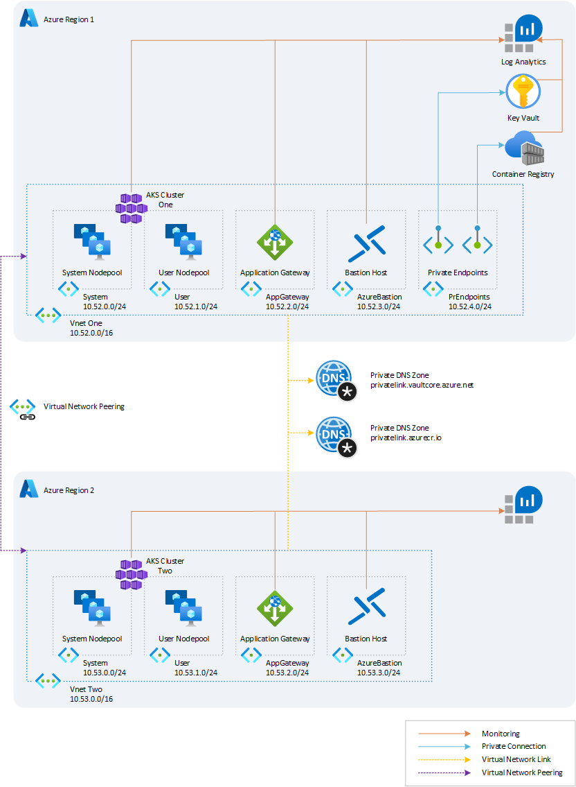
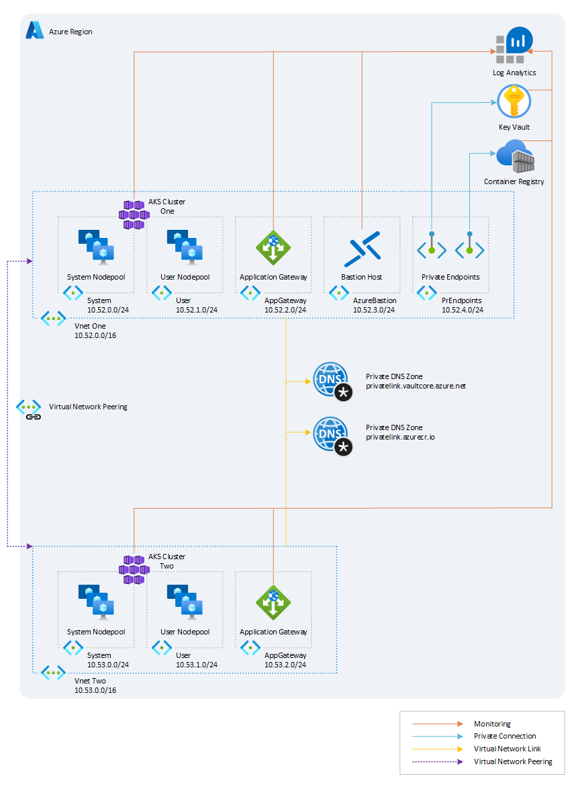

# Multicluster Istio on AKS

This sample shows how to Install an [Istio](https://istio.io/) mesh across multiple [Azure Kubernetes Service (AKS)](https://learn.microsoft.com/en-us/azure/aks/intro-kubernetes) clusters. For more information, see [Install Multicluster](https://istio.io/latest/docs/setup/install/multicluster/) in the Istio documentation.

## Deploy Kubernetes clusters

The Terraform code in this repository is provided for demo purposes and deploys the network topology shown in the following diagram.



The infrastructure is composed of two regional sites each hosting an AKS cluster. In each region, the infrastructure is composed of the following resources:

- A virtual network in each region with the following subnets:
  - `System` used by the AKS system node pool
  - `User` used by the AKS user node pool
  - `AppGateway` used by the Application Gateway
  - `AzureBastionHost` used bu Azure Bastion
  - `PrivateEndpoints` used by Azure Private Endpoints
- A virtual network peering between the two regional virtual networks
- A user-defined managed identity used as identity by the AKS cluster
- An AKS cluster uses composed of two node pools, each in separate subnet:
  - `System` node pool hosting only critical system pods and services. The worker nodes have node taint which prevents application pods from beings scheduled on this node pool.
  - `User` node pool hosting user workloads and artifacts.
- An Azure Key Vault instance.
- An Azure Bastion resource that provides secure and seamless SSH connectivity to the AKS agent nodes over SSL
- An Azure Container Registry (ACR) to build, store, and manage container images and artifacts in a private registry for all types of container deployments. 
- When the ACR SKU is equal to Premium:
  - The registry has two replicas, one in each region.
  - A Private Endpoint is created to allow the private AKS cluster to access ACR via a private IP address. For more information, see [Connect privately to an Azure container registry using Azure Private Link](https://docs.microsoft.com/en-us/azure/container-registry/container-registry-private-link).
- A Private DNS Zone for the name resolution of ACR and Key Vault private endpoints.
- A Virtual Network Link between each Private DNS Zone and the two regional virtual networks.
- A Log Analytics workspace to collect the diagnostics logs and metrics of both the AKS cluster and other Azure services.

When deploying the two AKS clusters to the same region, the Terraform module deploys a single Azure Bastion Host and Azure Log Analytics workspace as shown by the following diagram:



The Istio CA is managed offline and the cluster certificates are stored in Azure Key Vault.

To run the Terraform code:

```sh
cp  terraform .tfvars
vim terraform.tfvars #customize if needed
terraform init -upgrade && terraform apply -var-file=terraform.tfvars
```

Get clusters credentials:

```sh
aksClusterOneName="<aks-cluster-one-name>"
aksClusterTwoName="<aks-cluster-two-name>"
aksClusterOneResourceGroupName="<aks-cluster-one-resource-group-name>"
aksClusterTwoResourceGroupName="<aks-cluster-two-resource-group-name>"

az aks get-credentials \
  --resource-group $aksClusterOneResourceGroupName \
  --name $aksClusterOneName
az aks get-credentials \
  --resource-group $aksClusterTwoResourceGroupName \
  --name $aksClusterTwoName
```

Test credentials:

```sh
aksClusterOneName="<aks-cluster-one-name>"
aksClusterTwoName="<aks-cluster-two-name>"

kubectl --context=$aksClusterOneName get nodes
kubectl --context=$aksClusterTwoName get nodes
```

## Istio CA

By default the Istio installation creates a self-signed Certification Authority (CA) along with a root certificate and key and uses them to sign the workload certificates. 
Two Istio installations with two different self-signed CAs cannot trust each other.
For this reason the first step to deploy Istio in multicluster is to create a Certification Authority that will be trusted by both clusters.

This process is documented in detail in [Plug in CA Certificates](https://istio.io/latest/docs/tasks/security/cert-management/plugin-ca-cert/)

The following script creates a root CA and certificate per each cluster.:

```sh
git clone git@github.com:istio/istio.git
cd istio
mkdir certs
cd certs
make -f ../tools/certs/Makefile.selfsigned.mk root-ca
make -f ../tools/certs/Makefile.selfsigned.mk <aks-cluster-one-name>-cacerts
make -f ../tools/certs/Makefile.selfsigned.mk <aks-cluster-two-name>-cacerts
```

## Istio CA with Key Vault

Now we can proceed to store the cluster certificates we created at the previous step into Azure Key Vault.

Store the CA Certificate first: we are going to store only the certificate and not the private key that we want to keep offline:

```sh
sharedResourceGroupName="..."

export keyVaultName=$(az keyvault list --resource-group $sharedResourceGroupName --query [].name --output tsv)
az keyvault secret set \
  --vault-name $keyVaultName \
  --name root-cert \
  --file root-cert.pem
```

Combine the cluster certificate and the key in a single file and upload the certificate to Azure Key Vault:

```sh
aksClusterOneName="<aks-cluster-one-name>"
aksClusterTwoName="<aks-cluster-two-name>"
clusters=($aksClusterOneName $aksClusterTwoName)

for cluster in ${clusters[@]} ; do
(cd $cluster &&
cat ca-cert.pem ca-key.pem > ca-cert-and-key.pem &&
az keyvault secret set \
  --vault-name $keyVaultName \
  --name $cluster-cert-chain \
  --file cert-chain.pem &&
az keyvault certificate import \
  --vault-name $keyVaultName \
  --name $cluster-ca-cert \
  --file ca-cert-and-key.pem );
done
```

**NOTE**:
> If the `az keyvault certificate import` step fails complaining about the PEM format, try the workaround published [here](https://github.com/Azure/azure-cli/issues/8099#issuecomment-795180979).

## Create the ServiceProviderClass

The [Azure Key Vault Provider for Secrets Store CSI Driver](https://learn.microsoft.com/en-us/azure/aks/csi-secrets-store-driver) allows for the integration of an Azure key vault as a secrets 
store with an Azure Kubernetes Service (AKS) cluster via a CSI volume.
Now let's create a `SecretProviderClass` that will allow Istio to consume secrets from the Azure Key Vault.
The `SecretProviderClass` object needs to be created in the `istio-system` namespace.
Run these commands from your Terraform folder:

```sh
aksClusterOneName="<aks-cluster-one-name>"
aksClusterTwoName="<aks-cluster-two-name>"
clusters=($aksClusterOneName $aksClusterTwoName)

for cluster in ${clusters[@]} ; do 
  kubectl create --context=$cluster namespace istio-system; 
done
terraform output -raw secret_provider_class_location_one | kubectl --context=$aksClusterOneName -n istio-system apply -f -
terraform output -raw secret_provider_class_location_two | kubectl --context=$aksClusterTwoName -n istio-system apply -f -
```

## Install Istio in the clusters

Let's create the `istio-ingress` namespace to install the [Istio Ingress Gateways](https://istio.io/latest/docs/tasks/traffic-management/ingress/ingress-control/) for the North/South traffic, and let's enable injection in this namespace.

```sh
aksClusterOneName="<aks-cluster-one-name>"
aksClusterTwoName="<aks-cluster-two-name>"
istioRevision="1-14-1"

kubectl create --context=$aksClusterOneName ns istio-ingress
kubectl label --context=$aksClusterOneName ns istio-ingress istio.io/rev=$istioRevision
kubectl create --context=$aksClusterTwoName ns istio-ingress
kubectl label --context=$aksClusterTwoName ns istio-ingress istio.io/rev=$istioRevision
```

We are now ready to install istio on both clusters:

```sh
aksClusterOneName="<aks-cluster-one-name>"
aksClusterTwoName="<aks-cluster-two-name>"
istioRevision="1-14-1"
tag="1.14.1"

(cd istio-installation &&
istioctl install -y \
  --context=$aksClusterOneName \
  --set profile=minimal \
  --revision=$istioRevision \
  --set tag=$tag \
  -f 001-accessLogFile.yaml \
  -f 002-multicluster-region-one.yaml \
  -f 003-istiod-csi-secrets.yaml \
  -f 004-ingress-gateway.yaml &&
istioctl install -y \
  --context=$aksClusterTwoName \
  --set profile=minimal \
  --revision=$istioRevision \
  --set tag=$tag \
  -f 001-accessLogFile.yaml \
  -f 002-multicluster-region-two.yaml \
  -f 003-istiod-csi-secrets.yaml \
  -f 004-ingress-gateway.yaml
)
```

## Configure the remote endpoints secret

This step configures in each cluster the secret to reach the other one. Note that the Kubernetes secret contains also the cluster endpoint, it is like a `kubectl configuration`.

```sh
aksClusterOneName="<aks-cluster-one-name>"
aksClusterTwoName="<aks-cluster-two-name>"

istioctl x create-remote-secret --context=$aksClusterOneName --name=$aksClusterOneName | kubectl apply -f - --context=$aksClusterTwoName
istioctl x create-remote-secret --context=$aksClusterTwoName --name=$aksClusterTwoName | kubectl apply -f - --context=$aksClusterOneName
```

## Validate multicluster east west connectivity

At this point let's verify that the clusters are connected and synced:

```sh
$ istioctl remote-clusters --context=$aksClusterTwoName
NAME               SECRET                                              STATUS     ISTIOD
<aks-cluster-one-name>     istio-system/istio-remote-secret-<aks-cluster-one-name>     synced     istiod-1-14-1-689c9f5f7-n9r4p

$ istioctl remote-clusters --context=$aksClusterOneName
NAME           SECRET                                          STATUS     ISTIOD
<aks-cluster-two-name>     istio-system/istio-remote-secret-<aks-cluster-two-name>     synced     istiod-1-14-1-67d5b5fdfc-nm6w5
```

Let's deploy an EchoServer and let's access it from the other cluster. An EchoServer is an application that allows a client and a server to connect so a client can send a message to the server and the server can receive the message and send, or echo, it back to the client. Let's create a deployment called `echoserver` only in the first region. The service `echoserver` will be created in both regions, because this will make it possible to resolve the DNS name `echoserver`.

```sh
aksClusterOneName="<aks-cluster-one-name>"
aksClusterTwoName="<aks-cluster-two-name>"
istioRevision="1-14-1"

kubectl create --context=$aksClusterOneName ns echoserver
kubectl label --context=$aksClusterOneName ns echoserver istio.io/rev=$istioRevision
kubectl create --context=$aksClusterTwoName ns echoserver
kubectl label --context=$aksClusterTwoName ns echoserver istio.io/rev=$istioRevision
kubectl apply --context=$aksClusterOneName -n echoserver -f istio-installation/echoserver.yaml -f istio-installation/echoserver-svc.yaml
kubectl apply --context=$aksClusterTwoName -n echoserver -f istio-installation/echoserver-svc.yaml
```

Now let's access the `echoserver` from the remote cluster in the second region:

```sh
kubectl run --context=$aksClusterTwoName -n echoserver -ti curlclient --image=nicolaka/netshoot /bin/bash
$ curl echoserver:8080
```

## Expose the Istio ingress gateway

Before we begin remember that in `004-ingress-gateway.yaml` we patched the `istio-ingressgateway` service to be
`ClusterIP`, because we are going to expose it now with an Application Gateway.

We are now going to expose the `istio-ingressgateway` only in the AKS cluster in the first region.
You can apply the following configuration to both clusters if you want.

Let's configure the ingress and the gateway:

```sh
kubectl apply -f istio-installation/gateway.yaml
kubectl apply -f istio-installation/ingress.yaml
```

Now you can reach the envoy of the `istio-ingressgateway` and you will get a HTTP 404:

```sh
curl -v $(kubectl get ingress -n istio-ingress istio-ingress-application-gateway -o json | jq -r '.status.loadBalancer.ingress[0].ip')
*   Trying x.x.x.x:80...
* Connected to x.x.x.x (x.x.x.x) port 80 (#0)
> GET / HTTP/1.1
> Host: x.x.x.x
> User-Agent: curl/7.79.1
> Accept: */*
>
* Mark bundle as not supporting multiuse
< HTTP/1.1 404 Not Found
< Date: Wed, 13 Jul 2022 12:05:00 GMT
< Content-Length: 0
< Connection: keep-alive
< server: istio-envoy
<
* Connection #0 to host x.x.x.x left intact
```

Let's create the an [Istio Virtual Service](https://istio.io/latest/docs/reference/config/networking/virtual-service/) to invoke the `echoserver` Kubernetes service.

```sh
 sed -i -e "s/x.x.x.x/$(kubectl get ingress -n istio-ingress istio-ingress-application-gateway -o json | jq -r '.status.loadBalancer.ingress[0].ip')/" istio-installation/virtualservice.yaml
kubectl apply -f istio-installation/virtualservice.yaml
```

Now you have to use the hostname to `curl`:

```sh
curl -v $(kubectl get ingress -n istio-ingress istio-ingress-application-gateway -o json | jq -r '.status.loadBalancer.ingress[0].ip').nip.io
```

In the above command we leverage the [nip.io](https://nip.io/) free service that makes it easy to quickly have a DNS name for any IP address for troubleshooting and testing.

In this section, we configured the following artifacts:

- The application gateway with the file `istio-installation/ingress.yaml`
- The `istio-ingressgateway` with the files `istio-installation/gateway.yaml` and `istio-installation/virtualservice.yaml`

## End-to-End TLS

Now that you understand the basics of exposing the `istio-ingressgateway` behind an Application Gateway Ingress,
let's extend our configuration to use TLS.

The goal is to have TLS in the frontend exposed to the Internet, and also in the backend using a TLS connection from the Application Gateway to the backend that is the `istio-ingressgateway` Pod.

What we describe in the following is a summary of the 2 documentation pages:

- [Create a certificate and configure the certificate to AppGw](https://azure.github.io/application-gateway-kubernetes-ingress/features/appgw-ssl-certificate/)
- [Tutorial: Setting up E2E SSL](https://azure.github.io/application-gateway-kubernetes-ingress/tutorials/tutorial.e2e-ssl/)

For simplicity we are going to show the steps for the cluster `<aks-cluster-one-name>` only.

## Frontend certificate

The frontend certificate, is the certificate the application gateway will serve to the clients on the Internet. For the sake of simplicity we just create a self signed certificate in our Azure Key Vault:

```sh
export keyVaultName=$(az keyvault list --resource-group <prefix>-<region>-shared-rg --query [].name --output tsv)
az keyvault certificate create \
  --vault-name $keyVaultName \
  --name mycert \
  --policy "$(az keyvault certificate get-default-policy --output json)"
versionedSecretId=$(az keyvault certificate show \
  --name mycert \
  --vault-name $keyVaultName \
  --query "sid" \
  --output tsv)
unversionedSecretId=$(echo $versionedSecretId | cut -d'/' -f-5) # remove the version from the url
```

The above steps create a certificate with `CN=CLIGetDefaultPolicy`. You can modify the default-policy or provide a proper certificate if you wish.

Now let's import the certificate from Azure Key Vault into the Application Gateway. To do this we also need to make sure the Application Gateway has the permission to read secrets from the Azure Key Vault.

```sh
# Get the resource group name of the AKS cluster
aksResourceGroupName=$(az aks show \
  --name <aks-cluster-one-name> \
  --resource-group <prefix>-<region>-one-rg \
  --query nodeResourceGroup \
  --output tsv)

# Get principalId of the AGIC managed identity
agicIdentityPrincipalId=$(az identity show \
  --name ingressapplicationgateway-<aks-cluster-one-name> \
  --resource-group $aksResourceGroupName \
  --query principalId \
  --output tsv)

# One time operation, create user-assigned managed identity
az identity create \
  --name appgw-id \
  --resource-group <prefix>-<region>-one-rg \
  --location <region>

identityID=$(az identity show \
  --name appgw-id \
  --resource-group <prefix>-<region>-one-rg \
  --output tsv \
  --query "id")

identityPrincipal=$(az identity show \
  --name appgw-id \
  --resource-group <prefix>-<region>-one-rg \
  --output tsv \
  --query "principalId")

# One time operation, assign AGIC identity to have operator access over AppGw identity
az role assignment create \
  --role "Managed Identity Operator" \
  --assignee $agicIdentityPrincipalId \
  --scope $identityID

# One time operation, assign the identity to Application Gateway
az network application-gateway identity assign \
  --gateway-name aks-agw-<region> \
  --resource-group <prefix>-<region>-one-rg \
  --identity $identityID

# One time operation, assign the identity GET secret access to Azure Key Vault
az keyvault set-policy \
  -n $keyVaultName \
  --resource-group <prefix>-<region>-one-rg \
  --object-id $identityPrincipal \
  --secret-permissions get

# Now that the application-gateway can read secrets from Azure Key Vault we can import the certificate:
az network application-gateway ssl-cert create \
  --name mykvsslcert \
  --gateway-name  aks-agw-<region> \
  --resource-group $aksResourceGroupName \
  --key-vault-secret-id $unversionedSecretId
```

The name `mykvsslcert` is going to be used later in the ingress annotations to reference this certificate.

## Backend certificate

For the connection to the backend, we need the `application-gateway` to trust certificates emitted by the Istio CA, because we are going to use a Istio CA certificate for the `istio-ingressgateway` pod. To do this we add our `root-cert.pem` certificate to the `application-gateway`:

```sh
applicationGatewayName="<application-gateway-name>"
applicationGatewayResourceGroupName="<application-gateway-resource-group-name>"

 az network application-gateway root-cert create \
  --gateway-name $applicationGatewayName \
  --resource-group $applicationGatewayResourceGroupName \
  --name backend-tls \
  --cert-file root-cert.pem
```

The name `backend-tls` will be used later in the ingress annotations to reference this CA.
Let's generate a x509 certificate signed by the Istio CA and lets upload it to Azure Key Vault:

```sh
cd <istiorepo>/certs
mkdir echoserver
cd echoserver
openssl req -out echoserver.echoserver.svc.cluster.local.csr -newkey rsa:2048 -nodes -keyout echoserver.echoserver.svc.cluster.local.key -subj "/CN=echoserver.echoserver.svc.cluster.local/O=Istio Services"
openssl x509 -req -sha256 -days 365 -CA ../root-cert.pem -CAkey ../root-key.pem -set_serial 1 -in echoserver.echoserver.svc.cluster.local.csr  -out echoserver.echoserver.svc.cluster.local.pem

cat echoserver.echoserver.svc.cluster.local.pem echoserver.echoserver.svc.cluster.local.key > echoserver.pem
export keyVaultName=$(az keyvault list \
  --resource-group <prefix>-<region>-shared-rg \
  --query [].name
  --output tsv)
az keyvault certificate import \
  --vault-name $keyVaultName \
  --name echoserver \
  --file echoserver.pem
```

We need to create a `SecretProviderClass` in the `istio-ingress` namespace to read this certificate from Kubernetes. We also need to patch the `ingressgateway` deployment to mount the certificate in the pods.

```sh
aksClusterOneName="<aks-cluster-one-name>"

terraform output -raw secret-provider-class-ingress | kubectl --context=$aksClusterOneName -n istio-ingress apply -f -
cd cd istio-installation
istioctl install -y \
  --context=$aksClusterOneName \
  --set profile=minimal \
  --revision=1-14-1 \
  --set tag=1.14.1 \
  -f 001-accessLogFile.yaml \
  -f 002-multicluster-region-one.yaml \
  -f 003-istiod-csi-secrets.yaml \
  -f 004-ingress-gateway-csi.yaml # <-- note the "-csi" file
```

Now that all the certificates needed are in place, we can patch our existing `gateway`, `virtualService` and `ingress` to use TLS.

```sh
kubectl apply -f gateway-tls.yaml -f virtualservice-tls.yaml -f ingress-tls-e2e.yaml
```

## Verify and troubleshoot

Let's try to reach the echoserver exposed with the Ingress using TLS:

```sh
curl -kv https://$(kubectl get ingress -n istio-ingress istio-ingress-application-gateway -o json | jq -r '.status.loadBalancer.ingress[0].ip').nip.io
```

Note that the `-k` parameter in curl is needed because we used a self-signed certificate for the frontend.
